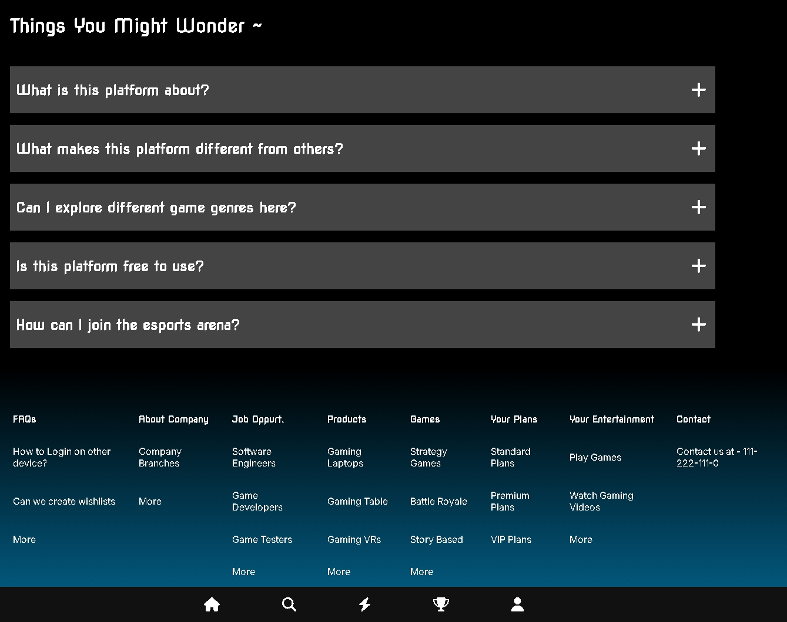
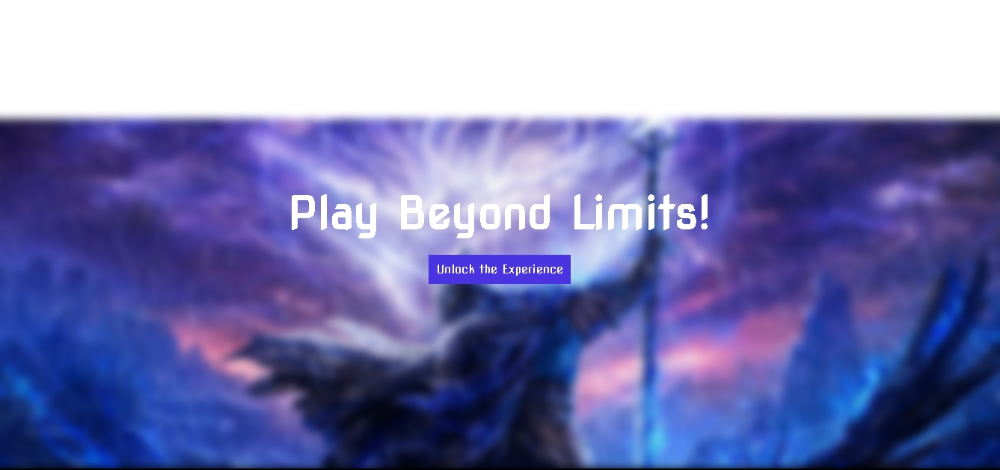
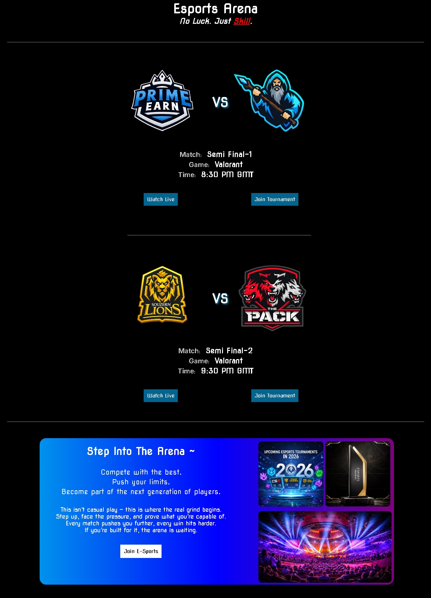
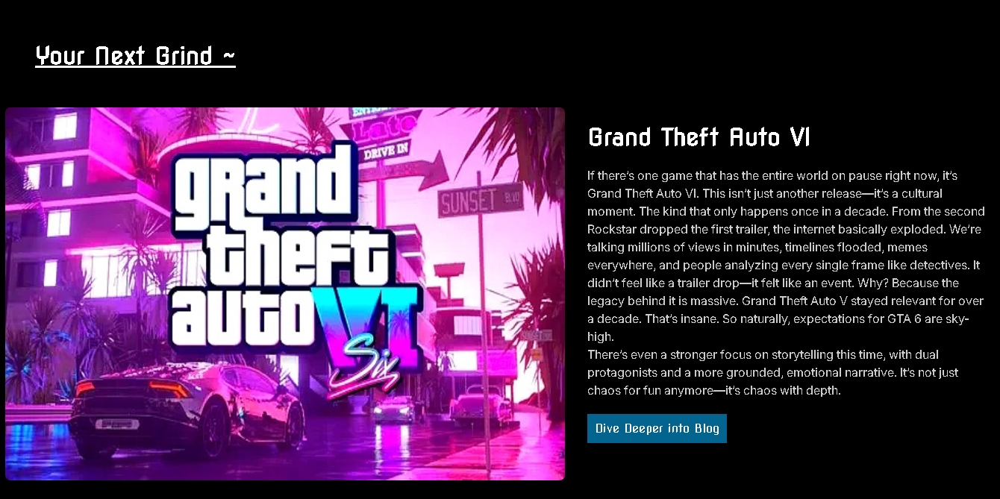
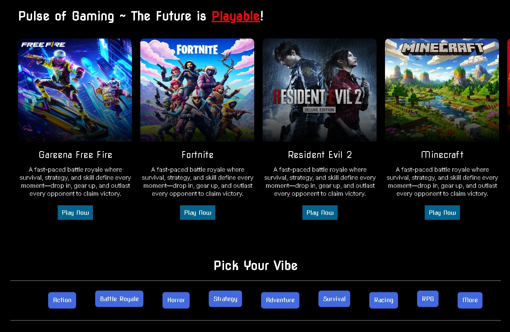
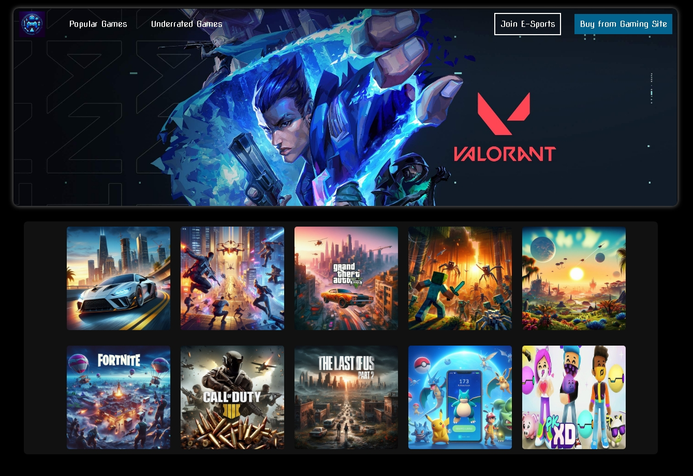

🎮 PLAYON — Find Your Next Obsession
PLAYON is a modern, immersive gaming platform concept built using pure HTML & CSS. Designed with a cinematic approach, it delivers a responsive and visually rich experience where users can explore games, discover their vibe, and step into the world of esports.

✨ Features
(1) Immersive and cinematic UI experience
(3) Clean, minimal, and modern design system
(4) Engaging visual hierarchy and layout flow
(5) Consistent color scheme with dark gaming aesthetics
(6) Interactive elements and micro-animations
(7)Concept-driven design with real product feel
(8) User-focused structure for seamless navigation
(9) Mobile-first responsiveness and adaptability

🛠️ Built With
HTML5
CSS3 

🌍 Vision
PLAYON is more than just a UI project.
It represents a concept of a next-generation gaming platform focused on immersive design, modern user experience, and interactive storytelling.

📌 Disclaimer
This project is created for educational and portfolio purposes only.
Some images, videos, and game assets belong to their respective owne

⭐ Support
If you like this project, consider giving it a ⭐ on GitHub!

📸 Preview

